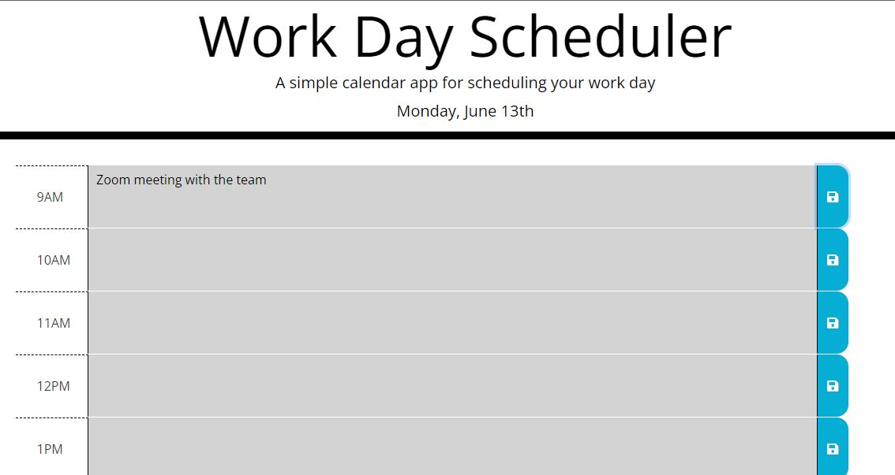

# work-day-scheduler

## Table of contents

- [General info](#general-info)
- [Technologies](#technologies)
- [App](#app)
- [Contact me](#contact-me)

## General info

Planner that saves notes using local storage.

## Technologies

Project is created with:

- JavaScript
- HTML
- CSS
- Bootstrap
- Moment.js

## App

- Enter a calendar note, click save, refresh your browser, and your note will still display .
  

- [Deployed App Link](https://12mchavez.github.io/work-day-scheduler/)

## Contact me

- [Email: mel.chavez.code@gmail.com](mailto:mel.chavez.code@gmail.com)
- [GitHub: 12MChavez](https://github.com/12MChavez)
